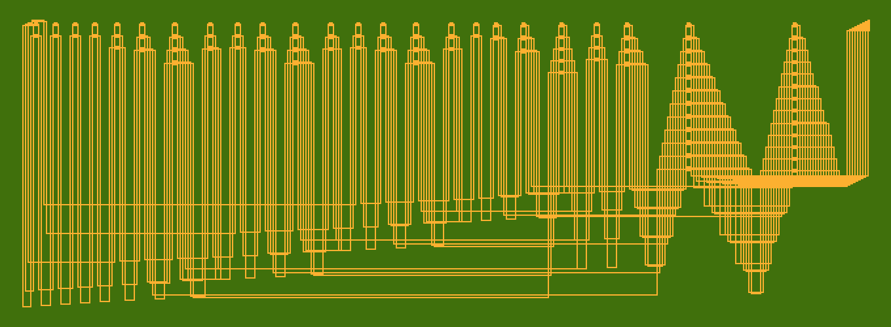
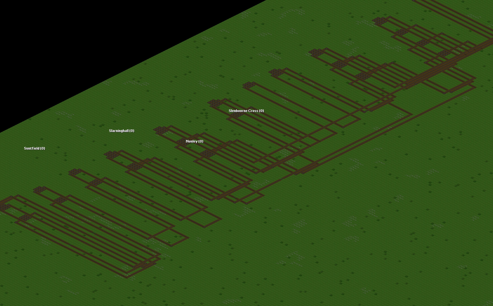
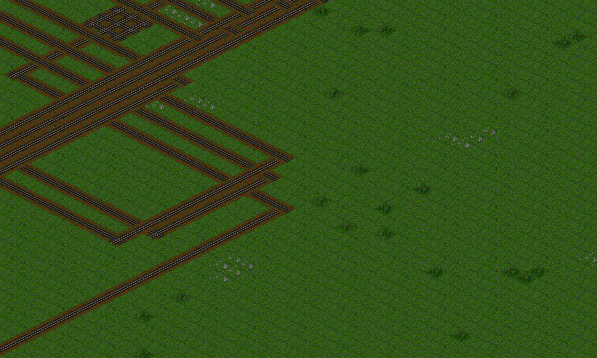
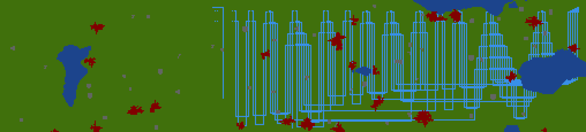
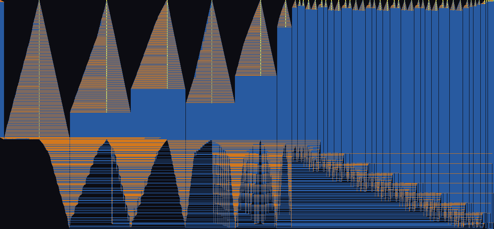
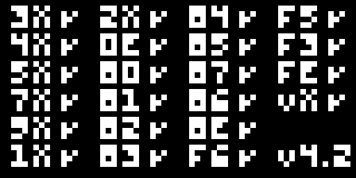

# openttdoom

A Wolfenstein-3D style raycaster running on a small computer built entirely out of
OpenTTD trains and signals, with the framebuffer drawn as on-map signals. A block signal
is red when its block is occupied, so a signal is a one-bit sensor, a train is a bit, and
track geometry is a logic gate. Wire enough of them together and you have a CHIP-8-class
machine whose display is signals lit on the map.

This is a long-horizon research project, and the headline result is that the hard part is
no longer a hypothesis: a logic gate that actually computes inside OpenTTD has been built
and verified in game, and so has a two-gate chain that composes them. The full software
toolchain that compiles a circuit down to a map is complete and verified, and a 4-bit
adder and an 8-bit CHIP-8 ALU both close through it end to end.



*The 4-bit ripple-carry adder, placed and routed by the toolchain and stamped into a real
OpenTTD map.*

## Where we are

"A DOOM frame rendered in OpenTTD" has two readings. The easy one, a DOOM-style frame shown
as pixels on the map, is **done**: we run a raycaster ROM, get a 64x32 frame, and stamp it onto
the map as tiles (see the frame images below). The real goal is the hard one, a DOOM frame
**computed by the train-built machine** and lit up on its own signal display. Progress toward
that:

```
Machine-computed DOOM frame:  [#######-----------------------]  ~23%
```

That number is deliberately honest: every research UNKNOWN is now retired (a gate computes,
gates compose, there is a clock, the toolchain compiles a circuit to a map, the workload
renders, and the box can even build OpenTTD from source), but the remaining ~80% is
construction at scale (the full CPU, built as thousands of computing gates, run fast enough to
finish a frame), which is large but no longer a mystery.

### Milestones achieved (all verified, most in game)

- **The toolchain compiles a circuit to an OpenTTD map**, verified end to end in software: a
  4-bit adder and an 8-bit CHIP-8 ALU both go HDL to netlist to NOR to place-and-route to
  scenario with the logic preserved at every step. Routing reaches 100 percent via perpendicular
  bridges, and a real yosys techmap is wired in (adder 92 to 62 NOR cells, ALU 891 to 442).
- **The workload renders**: a complete CHIP-8 interpreter passes the Timendus reference ROMs by
  exact hash, and a from-scratch raycaster ROM draws a pseudo-3D maze.
- **A frame is rendered as on-map pixels**: the IBM logo and a raycaster frame stamped straight
  into a savegame as rail tiles (the direct save writer does the 4-bit adder, ~40k tiles, in
  ~0.3s).
- **A logic gate computes in OpenTTD**: a 2-input NOR, truth table 1,0,0,0, independently
  re-verified.
- **Gates compose**: a 2-gate chain computing OR = NOT(NOR), 0,1,1,1, triple-verified.
- **A clock train and live re-evaluation** of a gate on the same tiles, verified.
- **A reliable clock-synchronised NOT gate**: output NOT(0,1,1,0,1,0) = 1,0,0,1,0,1, reproduced
  8 of 8 independent fresh runs.
- **OpenTTD builds from source on this box** (MSVC 2022 + vcpkg + CMake), so the speed fork is no
  longer environment-blocked, and a first fork already gives about 3x on a bare map.
- **The toolchain emits a cell that COMPUTES**: a NOR2 netlist goes through place-and-route and
  the GameScript stamps the verified computing geometry at the placed position (not hand-coded),
  and it computes 1,0,0,0 = NOR in OpenTTD, reproduced across fresh runs. This is the first time
  the pipeline produces working hardware, not just a picture of it.

### Key blockers to a machine-computed DOOM frame

1. **No self-contained clock yet.** The clocked gate works but the per-edge release is
   GameScript-mediated. A pure track-signal interlock failed on an OpenTTD reservation-coupling
   (reading the clock block's occupancy stalls the clock), and there is no physical output
   register. A real machine needs a self-sustaining clock and a one-edge latch.
2. **Multi-cell wiring at scale.** A single emitted cell computes, and a 2-cell circuit now does too:
   an emitted OR = NOT(NOR) computes 0,1,1,1, with the bit carried physically over a track spur (the
   placer co-locates the consumer under its driver so the coupling is the proven short vertical spur).
   The mechanism is verified, but its reliability is still flaky under load (train-dispatch races), and
   it only covers a 2-stage chain with fan-out 1. Generalising the co-location to fan-out greater than
   one, deeper chains, and wider gates, reliably, is the work between here and emitting the whole adder.

1. **No self-contained clock yet.** The clocked gate works but the per-edge release is
   GameScript-mediated. A pure track-signal interlock failed on an OpenTTD reservation-coupling
   (reading the clock block's occupancy stalls the clock), and there is no physical output
   register. A real machine needs a self-sustaining clock and a one-edge latch.
2. **The emitter stamps placeholder track, not computing cells.** The verified NOR-gate geometry
   exists, but `place_and_route` to GameScript (`StampCell`) still lays illustrative track. Until
   the real geometry is folded in, the pipeline draws the CPU's floor plan, it does not build a
   working one.
3. **The machine does not exist yet.** Only a 4-bit adder and an 8-bit ALU exist as netlists. A
   CHIP-8 CPU also needs a register file, instruction decoder, memory, and a display driver, none
   of which are built, then all of it assembled as thousands of computing gates on the map.
4. **Speed.** Even fully built, computing one CHIP-8 frame at stock OpenTTD speed is impractically
   slow (a 4-bit adder's carry took about two in-game months in the classic constructions). A first
   speed fork now exists and is verified: a runtime flag that strips the per-tick map housekeeping
   useless on a logic map (the cosmetic tile loop, town/tree/industry/station updates) while keeping
   the train and signal core, measured at about 3x on a bare map (see `docs/speed_fork.md` and
   `docs/speed_fork.patch`). That 3x is the fixed housekeeping removed; it shrinks toward 1x as the
   train count grows, so the deeper lever, pathfinding and per-train hot-path surgery for the fixed
   reader and clock routes, is the real remaining speed work.

## The in-game breakthroughs

These are verified in OpenTTD 15.3, built and observed entirely from a GameScript driven
headlessly over the admin port. They are not models, they were run.

**1. A single NOR gate that computes.** A bit is train presence on a piece of track. A
block signal is green only when its protected block is empty, so a reader train run
west to east passes the signal only when no input train is present, which is exactly NOR.
The output is read by where the reader train ends up (`GSVehicle.GetLocation`), since the
GS API exposes no signal-aspect read. The verified 2-input NOR truth table is
**1, 0, 0, 0** (00 to 1, 01 to 0, 10 to 0, 11 to 0), and the one-input case (a NOT) flips
A=0 to 1 and A=1 to 0 on the same physical gate poked twice. This was independently
re-verified through a second readout channel: the gate encodes the four raw reader-train x
positions into the company name, read back with `rcon companies`, giving
`NORFX sig46 51 45 39 39` and judged from the raw positions to 1, 0, 0, 0 = NOR by the
orchestrator, not by the GameScript's own logic. See `scenarios/norgate_gs/`.

**2. Gate composition, a two-gate chain.** Two of those gates are chained to compute
OR(a, b) = NOT(NOR(a, b)). Gate 1 is a 2-input NOR of the primary inputs; when its reader
passes (output 1) it is frozen on a coupling tile that a signal-free spur joins into gate
2's input block, so gate 1's output physically parks a train in gate 2's input. Gate 2 is
a NOT, and passes only when gate 1 did not. Triple-verified by fresh dedicated-server runs,
read via the company name as `OR s40 39 41 41 41` (SIG2X=40, reader x greater than 40 means
OR=1), judged from the raw positions to **0, 1, 1, 1 = OR(a, b)**. The per-case intermediate
positions also confirmed gate 1 computing NOR = 1, 0, 0, 0 inside the chain. See
`scenarios/norchain_gs/`.

So a gate computes, and gates compose. That is the foundation the rest of the machine is
built on, and it turns the project's deepest unknown into a known, working primitive.

## What it is and the pipeline

The whole project is one compiler from a circuit description down to an OpenTTD map, with a
software reference model running alongside to keep us honest. The substrate rule, fixed by
the brief, is that a net is one bit encoded by train presence, the only physically built
gate is NOR (NOT is a one-input NOR, and NOR is universal), and the design is synchronous,
clocked by a train on a fixed loop.

```
  golden model (Python CHIP-8 + viewer)     proves the workload renders, no OpenTTD
        |
  HDL  ->  netlist  ->  place & route  ->  scenario  ->  OpenTTD substrate
 (hdl/)   (synth/)    (place_and_route/)  (scenarios/)   (trains + signals)
```

- **golden/** A complete Python CHIP-8 interpreter and a framebuffer viewer. CHIP-8's
  64x32 monochrome display maps 1:1 onto the signal framebuffer, so this proves the
  workload renders with zero OpenTTD involvement. It is the oracle the hardware is checked
  against, pinned by exact framebuffer hashes against the Timendus reference ROMs.
- **hdl/** An Amaranth (Python) frontend: behavioural references and structural gate-level
  builders that emit a `Netlist`.
- **synth/** Synthesis lowers a netlist to the buildable set `{NOR, CONST0, CONST1}` via
  the tool-free `Netlist.to_nor()`, and (optionally, when oss-cad-suite is present) via a
  real yosys verilog-to-NOR techmap.
- **place_and_route/** Places every cell on a grid and routes every net with a complete
  channel router, crossing nets where needed as perpendicular bridges, then emits and
  DRC-checks a `Scenario`.
- **scenarios/** The emitter turns a placed `Scenario` into a Squirrel data table via
  `Scenario.to_nut()`, which a GameScript reads to stamp track, signals and trains.
- **OpenTTD substrate.** Bits are signal states, train presence is the value, and gates are
  track geometry.

The pipeline is verified in software at every stage, and both the 4-bit adder and the 8-bit
ALU close through it end to end with the logic preserved at each step.

### Relation to a real FPGA/ASIC flow

This is not a loose analogy, the stages line up one to one with a real hardware build. A common
point of confusion is to call the whole thing "synthesis", but synthesis and place-and-route are
two distinct stages here just as they are in Vivado, and our directories mirror that split:

| openttdoom stage | Vivado (FPGA) | ASIC flow |
| --- | --- | --- |
| `hdl/` (Amaranth) | RTL design entry | RTL |
| `synth/` (`to_nor()`, yosys techmap) | **Synthesis** (RTL to netlist, map to primitives) | Logic synthesis |
| `place_and_route/` (placer + channel router) | **Implementation** (`place_design` + `route_design`) | Floorplan / place / route |
| `scenario.to_nut()` emit | `write_bitstream` | GDSII / tape-out |
| OpenTTD map (trains + signals) | the configured FPGA fabric | the fabricated silicon |

So `synth/` is the synthesis-run analog and `place_and_route/` is the implementation-run analog,
they are adjacent stages, not the same one. Two details make the mapping tight: the NOR-only
"only buildable gate" set is our standard-cell/primitive library (the analog of LUTs and flip-flops),
so `to_nor()` is technology mapping, exactly what yosys `techmap`/`abc` do (and we run yosys for it);
and because the OpenTTD surface is essentially single-layer, the router crosses nets with physical
**bridges** (`Route.bridges`), our analog of the multiple metal layers and vias a real router uses.

Two places the analogy honestly breaks down are exactly where the open problems live: there is no
clock-tree-synthesis equivalent yet (distributing the train clock is unsolved, the reservation
-coupling blocker), and there is no static timing analysis (the train-propagation/clock-period
question is the open synchronous-element problem).

## The toolchain wins

- **Complete routing via perpendicular bridges.** A 4-bit adder netlist is not planar, so
  some wire crossings are unavoidable and a no-crossing router can never reach 100 percent.
  OpenTTD crosses tracks with bridges, so `place_and_route/channel_route.py` is a
  deterministic channel router that crosses nets as perpendicular bridges. The 1, 2 and
  4-bit adders all route to 100 percent, DRC clean, logic preserved (the 4-bit adder uses
  1958 bridge crossings on a 1024x256 map). The bridges flow through to the GameScript.
- **A real yosys NOR techmap.** With a full yosys (oss-cad-suite) installed,
  `synth/yosys_synth.py` runs the proper verilog-to-techmap-to-NOR flow and produces tighter
  netlists, verified `equivalent()` to the Python flow: the adder drops from 92 to 62 NOR
  cells, and the 8-bit ALU from 891 to 442 cells. yosys is optional and the flow skips
  cleanly when it is absent, with the tool-free Python `to_nor()` as the default.
- **A direct savegame writer.** `tools/sav_writer.py` stamps a design straight into an
  uncompressed OTTN save by editing the map tile arrays in place (the rail-tile encoding
  reverse-engineered from the OpenTTD 15.3 source, per `rail_map.h` MakeRailNormal). This is
  instant: the full 4-bit adder, roughly 40k tiles, lands in about 0.3 seconds, with no
  company, money or in-game build needed. It can also flatten the map to a plain canvas of
  any size.



*The same circuit in the actual game world (isometric view): a 1-bit full adder laid out as
real OpenTTD rail track.*



*A close-up of one full-adder's rail in OpenTTD, cross tiles laid at every route tile so the
layout reads clearly.*



*The 2-bit ripple adder on the minimap: the vertical teeth are the per-net trunk rows, the
horizontal lines are the routing highways, and the crossings are bridges.*

## The CHIP-8 ALU and the raycaster

**What "DOOM" means here, and why 8-bit CHIP-8.** There are two different DOOMs. *Real* DOOM
(id, 1993) needs a 32-bit CPU and about 4 MB of RAM; there is no genuine native 4-, 8-, or
16-bit port (the "DOOM runs on everything" stunts almost always stream the frame from external
compute), and the minimal honest native runs are 32-bit microcontrollers like the RP2040. So
real DOOM on a train computer is firmly roadmap-fantasy, and this repo says so. *Our* DOOM is a
Wolfenstein-3D-style raycaster running on a CHIP-8 machine, the realistic version of "DOOM on
trains". CHIP-8 is an 8-bit machine: sixteen 8-bit registers, an 8-bit ALU, 4 KB of memory
(12-bit addresses), 16-bit instructions. So the datapath width we need is 8-bit, not 4 and not
16: the 4-bit adder was only the de-risk demo, and 16-bit is overkill. The good news is that the
8-bit half that matters most is already through the pipeline (the ALU below is literally the
CHIP-8 instruction set). What is left to make it a CPU is the register file, instruction decoder,
4 KB memory, stack, timers and the display driver wrapped around that ALU.

**The ALU.** `hdl/alu.py` is the CHIP-8 8XY_ ALU as a real circuit through the whole
pipeline: it takes two 8-bit registers VX and VY plus a 4-bit op and produces an 8-bit
result and the VF flag, covering OR, AND, XOR, ADD, SUB, SHR, SUBN, SHL and LD with the
classic quirk defaults that match `golden/chip8.py`. It exists as a behavioural Amaranth
module, a hand-built structural netlist, and a plain Python reference, all checked
equivalent. This turns the toolchain demo into an actual piece of the target machine, and
it closes through synth and place-and-route just like the adder (891 to 442 NOR cells under
yosys).



*The 8-bit CHIP-8 ALU placed and routed.*

**The raycaster.** `golden/raycaster.py` is a minimal Wolfenstein-style raycaster
hand-assembled into a real CHIP-8 ROM. No plain-CHIP-8 64x32 raycaster ROM exists in the
wild (the known candidates are XO-CHIP and need extended opcodes and hires colour), so this
one is built from scratch with the in-repo assembler, executes for real in the golden
interpreter using only standard CHIP-8 opcodes, and draws vertical wall slices that form a
recognizable pseudo-3D corridor. It is a fixed-point DDA grid raycaster whose trig and
reciprocal tables are baked into the ROM, which on the train substrate become hardwired
landscape. The reference model and the assembled ROM are checked to produce identical
framebuffers.


*Two raycaster frames rendered by the ROM in the golden interpreter.*


*The CHIP-8 IBM-logo test render, one of the exact-hash golden checks.*



*The corax+ opcode test ROM in the interpreter: a checkmark next to every opcode group, a
visual cross-check of the ALU and control-flow opcodes.*

## A frame rendered on the OpenTTD map

The framebuffer is meant to live on the map as pixels, so the loop is closed: a ROM runs in
the golden interpreter, produces a 64x32 one-bit frame, and `tools/sav_writer.py`
(`stamp_framebuffer`) writes each lit pixel as a block of rail tiles straight into an OpenTTD
save. Loaded in game and screenshotted, the frame appears directly on the map (lit pixels are
orange rail, dark pixels are green grass). This is the P0 signals-as-pixels display, end to
end, golden model to OpenTTD screenshot.


*The IBM-logo framebuffer rendered as on-map rail tiles in OpenTTD.*


*A raycaster frame, the DOOM-style pseudo-3D view, rendered on the OpenTTD map.*

## Build and run

Everything targets Git-Bash / MINGW on Windows, the environment this repo was built and
verified in.

1. **Set up the environment.**

   ```
   bash scripts/setup.sh
   ```

   Pulls the prebuilt OpenTTD 15.3 win64 binary and OpenGFX 8.0 into `vendor/`, and
   pip-installs the Python toolchain (amaranth, numpy, pillow, pytest, pygame). It is
   idempotent. yosys and verilator (oss-cad-suite) are optional and documented but not
   installed by the script.

2. **Run the headless smoke test.**

   ```
   bash scripts/run_headless.sh [TICKS]
   ```

   Runs the binary with null drivers for `TICKS` ticks (default 20000) and exits. The
   Windows release binary is GUI-subsystem and does not pipe stdout, so success is exit 0
   and wall-clock time scaling with the tick count (about 6000 ticks per second here).

3. **Build the toolchain end to end.**

   ```
   bash scripts/build.sh
   ```

   Runs synth, then place-and-route plus the emitter on the 4-bit adder, copies the
   generated `.nut` into the GameScript, and runs the test suites.

For the OpenTTD renders and in-game runs:

- `tools/sav_writer.py` stamps a scenario or netlist straight into an uncompressed save,
  instantly, with no runtime build.
- `tools/ottd_render.py` is the full headless recipe: a dedicated server builds the design
  via the GameScript over the admin port, then a GUI run screenshots it.
- `tools/ottd_admin.py` drives the admin TCP port (rcon commands and state readback), which
  is how the dedicated server is controlled and how the gate results are read.

Run the tests with `python -m pytest -q`, or a single module's tests with, for example,
`python -m pytest place_and_route/test_pnr.py -q`.

## What is verified vs what is next

**Verified.**

- The prebuilt OpenTTD 15.3 binary runs headless (smoke test exits 0, wall-clock scales
  with ticks), with OpenGFX 8.0 in place.
- The golden CHIP-8 interpreter passes the Timendus reference ROMs by exact framebuffer
  hash, and the raycaster ROM matches its reference model.
- The toolchain closes in software: the 4-bit adder synthesises to 92 NOR cells (62 under
  yosys), places and routes to 100 percent with 0 DRC violations, and reconstructs to a
  netlist that adds correctly over all 512 input combinations. The 8-bit ALU closes the
  same way.
- A single computing NOR gate (truth table 1, 0, 0, 0) and a two-gate OR chain
  (0, 1, 1, 1) are built and verified in OpenTTD, the second independently re-verified
  through the company-name readout channel.

**What is next.** These are engineering on a working foundation, not unknowns (full detail
in STATUS.md and STUCK.md):

- The **clock train**: the verified gates are combinational, run on demand. The synchronous
  design needs a clock train that releases reader sampling on a shared periodic edge so a
  chain settles with one edge of register latency.
- **Multi-input NOR (3+ inputs)** and reliable in-place teardown so the same tiles can be
  re-evaluated each edge without hanging the script.
- **Framebuffer readout**: wiring per-net train presence into the framebuffer signal tiles
  for the viewer.
- **Folding the verified gate geometry into the place-and-route emitter** so the pipeline
  stamps computing cells, not just visible structure, including the in-game bridge build
  detail (bridge type, ramps, one-way signals) and the GameScript company build-context.

## Roadmap (out of scope this run)

Documented so the path is clear, not attempted this run:

- The **clock train** and the full register latency, then the **full CHIP-8 / XO-CHIP
  datapath** in HDL beyond the ALU.
- Running the **raycaster on the train-built machine** (it is a golden-model workload for now).
- The **OpenTTD engine fork for speed** (stripped tick loop, uncapped speed). Started: OpenTTD 15.3
  builds from source here (MSVC 2022 + vcpkg + CMake), and a first fork gating the per-tick map
  housekeeping behind a runtime flag gives about 3x on a bare map (`docs/speed_fork.md`,
  `docs/speed_fork.patch`). The deeper pathfinding/hot-path surgery for the fixed train routes is the
  remaining speed work.
- **Trains-as-pixels** display, instead of signals as pixels.
- **Colour, grayscale and Bayer dithering**; the framebuffer is 1-bit this run.
- Rendering actual **DOOM frames** (DOOM is the look and palette reference only).

CLAUDE.md, STATUS.md and STUCK.md hold the detailed per-milestone status and the isolated
hard problems. This README is the front door.
